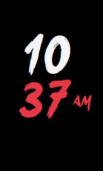
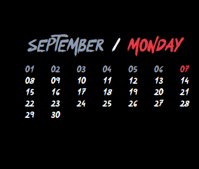

# ⛩️ Conky Okami Widgets

A minimalist, modular desktop widget suite for Linux featuring the Japanese brush font **Okami**.

## 📸 Showcase & Layouts

### Clock Variants
| 12-Hour Horizontal (Default) | 12-Hour Vertical (Stacked) | 24-Hour Horizontal | 24-Hour Vertical |
| :---: | :---: | :---: | :---: |
|  |  |  |  |

### Calendar Variants
| 7-Day Row Grid (Default) | Vertical Column (01..31) |
| :---: | :---: |
|  |  |

---

## ⚡ Quick Start

```bash
# 1. Install dependencies (Debian/Ubuntu/Mint)
sudo apt install conky-all fontconfig git

# 2. Clone & Install
git clone https://github.com/manas-kishan/conky-widgets.git
cd conky-widgets
./install.sh
```
> `./install.sh` automatically installs the bundled Okami font, configures user paths, and starts the widgets.

---

## 🕹️ Controls & Cheatsheet (`./control.sh`)

Manage everything from the root `./control.sh` script:

### Common Commands
| Action | Command | Description |
| :--- | :--- | :--- |
| **Start** | `./control.sh st` | Start all widgets (`st clo` or `st cal` for single) |
| **Stop** | `./control.sh sp` | Stop all widgets (`sp clo` or `sp cal` for single) |
| **Restart** | `./control.sh rs` | Reload / apply config changes |
| **Status** | `./control.sh stat` | Check running Conky processes |
| **Interactive** | `./control.sh twk` | Open guided tweak menu |

### Layout Switching
```bash
# Clock Variants (clo)
./control.sh clo 12h-h             # 12-Hour Horizontal (Default)
./control.sh clo 12h-v             # 12-Hour Vertical (Stacked)
./control.sh clo 24h-h             # 24-Hour Horizontal (Inline)
./control.sh clo 24h-v             # 24-Hour Vertical (Stacked)

# Calendar Variants (cal)
./control.sh cal grid              # 7-Day Row Grid (Default)
./control.sh cal col               # Vertical Column (01..31)

# Tweak Both in One Command
./control.sh 12h-v grid            # Direct multi-tweak (Clock -> 12h-v, Cal -> Grid)
./control.sh 12h-h col             # Direct multi-tweak (Clock -> 12h-h, Cal -> Column)
./control.sh preset compact        # Preset: 12h-h Clock + 7-Day Grid (Default)
./control.sh preset stacked        # Preset: 12h-v Clock + Vertical Column
```

---

## 🎨 Customization (Colors, Positions & Sizing)

Each widget has a single configuration file:
- **Clock**: `widgets/clock/clock.conf`
- **Calendar**: `widgets/calendar/calendar.conf`

### 1. Colors
Edit the hex values in either `.conf` file:
```lua
color1 = 'E63946',  -- Accent (AM/PM, weekday, today's date)
color2 = 'F5F5F7',  -- Primary (clock digits, upcoming dates)
color3 = '8D99AE',  -- Muted (month title, past dates)
```

### 2. Positioning
Adjust screen placement inside `conky.config`:
```lua
alignment = 'top_left',   -- Screen position (top_left, top_right, etc.)
gap_x     = 40,           -- Margin from screen edge in pixels
gap_y     = 140,          -- Vertical position (gap_y=140 places calendar below clock)
```

### 3. Font Scaling
Change sizes in `conky.text`:
- **Clock digits**: `font Okami:size=120` (horizontal) or `size=84` (vertical)
- **Month/Day banner**: `font Okami:size=28`
- **Calendar numbers**: In `widgets/calendar/okami-calendar.lua` (`size=15` for grid)

> **Tip**: After editing any file, run `./control.sh rs` to reload changes immediately.

---

## 🔄 Autostart on Login

Add this command to your desktop's **Startup Applications** (with a 5–8 second delay):
```bash
/bin/bash -c "sleep 8 && /path/to/conky-widgets/control.sh st"
```

---

## 📄 License
MIT License. Free to use and customize!
