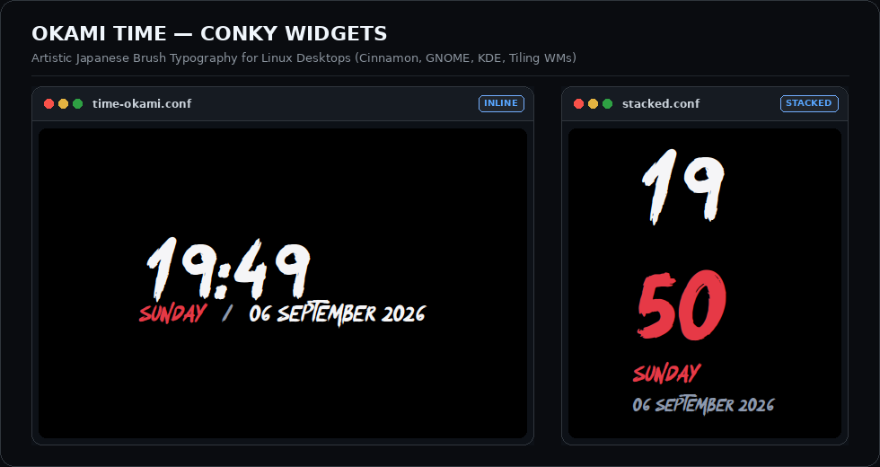
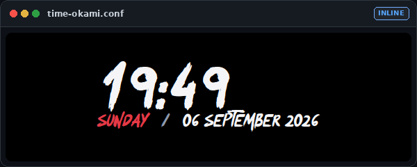
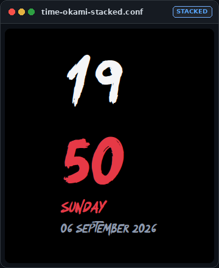

# ⛩️ Conky Widgets Collection

A modular, modern suite of custom Conky desktop widgets designed with high-impact typography and clean aesthetic principles.

Currently featuring the **Okami Time Widget**, rendered with the artistic Japanese brush font **Okami**.



---

## 📸 Preview & Layouts

| **Inline Minimalist Layout** (`time-okami.conf`) | **Vertical Stacked Layout** (`time-okami-stacked.conf`) |
| :---: | :---: |
|  |  |
| Horizontal brush clock with weekday and full date. | Compact stacked hours and minutes with crimson accent. |

---

## 📦 Prerequisites

Before installing, ensure you have **Conky** and **Git** installed on your Linux distribution:

### Debian / Ubuntu / Linux Mint / Pop!_OS
```bash
sudo apt update
sudo apt install conky-all git fontconfig
```

### Arch Linux / Manjaro
```bash
sudo pacman -S conky git fontconfig
```

### Fedora / RHEL
```bash
sudo dnf install conky git fontconfig
```

---

## 🚀 Installation & Quick Start

### 1. Clone the Repository
Clone this repository to your local machine (e.g. into your home folder or `~/.config/`):

```bash
git clone https://github.com/manas-kishan/conky-widgets.git
cd conky-widgets
```

### 2. Install the Bundled Fonts
Run the font installer to register the Okami font into your user font directory (`~/.local/share/fonts/`) and refresh FontConfig:

```bash
chmod +x scripts/*.sh widgets/*/*.sh
./scripts/install_fonts.sh
```

### 3. Launch the Widget
You can launch the widget using either the central manager CLI or directly:

```bash
# Using the central manager:
./scripts/conky-control.sh start time-okami

# Or launch directly:
./widgets/time-okami/start.sh
```

### 4. Switch to the Stacked Layout
To launch the vertical stacked layout instead:

```bash
./widgets/time-okami/start.sh --stacked
```

### 5. Stopping or Restarting Widgets
```bash
# Stop the widget:
./scripts/conky-control.sh stop time-okami
# or
./widgets/time-okami/stop.sh

# Restart the widget:
./scripts/conky-control.sh restart time-okami

# Check widget status:
./scripts/conky-control.sh status
```

---

## 📁 Repository Structure

```text
conky-widgets/
├── assets/                           # Layout screenshots and showcase preview
├── fonts/
│   └── Okami.otf                     # Bundled Okami brush font
├── scripts/
│   ├── install_fonts.sh              # Font installer & fontconfig cache updater
│   └── conky-control.sh              # Central CLI manager (start/stop/restart/list/status)
├── widgets/
│   └── time-okami/
│       ├── time-okami.conf           # Primary inline configuration
│       ├── time-okami-stacked.conf   # Vertical stacked configuration
│       ├── okami-calendar.lua        # Vertical date column Lua script
│       ├── start.sh                  # Widget launcher (supports --stacked)
│       └── stop.sh                   # Widget terminator
└── README.md
```

---

## 🎨 Customization Guide

All configuration files are written in standard, clean Conky Lua syntax.

### Changing Colors
Open `widgets/time-okami/time-okami.conf` (or `time-okami-stacked.conf`) and edit the color variables:

```lua
color1 = 'E63946',  -- Accent color (Day of week / stacked minutes)
color2 = 'F5F5F7',  -- Primary time digits & date
color3 = '8D99AE',  -- Subtitles / separators
```

Popular accent colors:
- **Crimson Vermilion** (Default): `E63946`
- **Amber Gold**: `FFA300`
- **Neon Cyan**: `00F0FF`
- **Emerald Mint**: `2EC4B6`
- **Purple Orchid**: `9D4EDD`

### 12-Hour vs 24-Hour Format
In `time-okami.conf`, find `conky.text`:

- **24-Hour Format** (Default):
  ```lua
  ${color2}${font Okami:size=72}${time %H:%M}${font}
  ```
- **12-Hour Format**:
  ```lua
  ${color2}${font Okami:size=72}${time %I:%M}${font}
  ```
- **12-Hour Format with AM/PM**:
  ```lua
  ${color2}${font Okami:size=72}${time %I:%M}${font} ${color1}${font Okami:size=22}${time %p}${font}
  ```

### Position & Screen Offsets
Modify the window placement parameters inside `conky.config`:

```lua
alignment = 'top_left',   -- Options: 'top_left', 'top_right', 'bottom_left', 'bottom_right', 'middle_middle'
gap_x = 40,               -- Horizontal offset from screen edge (pixels)
gap_y = 40,               -- Vertical offset from screen edge (pixels)
```

---

## 🔄 Autostart on Boot (Any Linux Desktop)

Because Conky needs your desktop environment and window compositor to finish loading before drawing, a small startup delay (5–10 seconds) is recommended.

### Method 1: Graphical Startup Applications (GNOME, Cinnamon, KDE, XFCE)
1. Open your desktop's **Startup Applications** (or **Autostart**) settings.
2. Click **Add / New**.
3. Fill in the fields:
   - **Name**: `Conky Okami Time`
   - **Command**:
     ```bash
     /bin/bash -c "sleep 8 && /path/to/conky-widgets/widgets/time-okami/start.sh"
     ```
     *(Replace `/path/to/conky-widgets` with your actual cloned repository path, e.g. `/home/yourusername/conky-widgets`).*
   - **Delay**: `8` seconds (if supported by your UI).
4. Save and exit.

### Method 2: Standard XDG Autostart Desktop File
Create an autostart desktop entry:

```bash
mkdir -p ~/.config/autostart
nano ~/.config/autostart/conky-okami.desktop
```

Paste the following (make sure to replace `/path/to/conky-widgets` with your actual path):

```ini
[Desktop Entry]
Type=Application
Name=Conky Okami Time
Comment=Launch Okami Conky Widget on login
Exec=/bin/bash -c "sleep 8 && /path/to/conky-widgets/widgets/time-okami/start.sh"
Hidden=false
NoDisplay=false
X-GNOME-Autostart-enabled=true
```

---

## ➕ Adding More Widgets

The project structure is built to scale modularly:
1. Create a new directory under `widgets/`, for example `widgets/system-stats/` or `widgets/weather/`.
2. Place your `.conf` files and optional `start.sh`/`stop.sh` inside.
3. `./scripts/conky-control.sh` will automatically detect your new widget:
   ```bash
   ./scripts/conky-control.sh list
   ./scripts/conky-control.sh start system-stats
   ```

---

## 🔧 Troubleshooting

- **Font not showing properly?** Re-run `./scripts/install_fonts.sh` to refresh the fontconfig cache.
- **Widget not launching?** Run Conky in the foreground to view any errors:
  ```bash
  conky -c "./widgets/time-okami/time-okami.conf" -i 1
  ```
- **Transparency / compositor issues?** Ensure your desktop compositor is enabled, and verify `own_window_transparent = false` and `own_window_argb_visual = true` in the configuration.

---

## 📄 License

This project is open source. Feel free to customize and expand upon it for your desktop setups!
